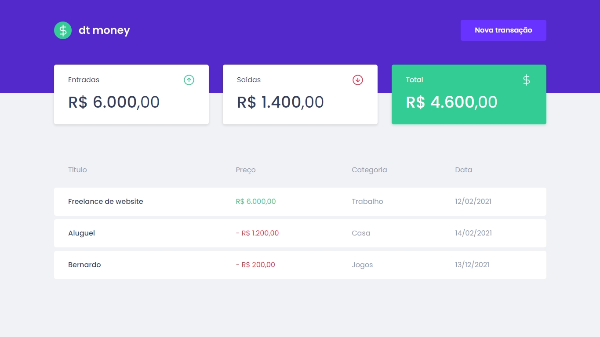

# dt money

Esse desafio, foi realizado para treinar o que aprendeu até agora no ReactJS

É uma pequena aplicação para cálculo de atividades e contas em que foi criado para treinar um pouco mais sobre manipulação do estado no React, manipulação de Contextos, API Fakes com MirageJS e utilização de CSS in JS.

## Tecnologias

- React
- Typescript
- Styled-Components
- MirageJS
- Polished

## Extras

<!-- - Notificação das ações
- Responsividade (mobile) -->

